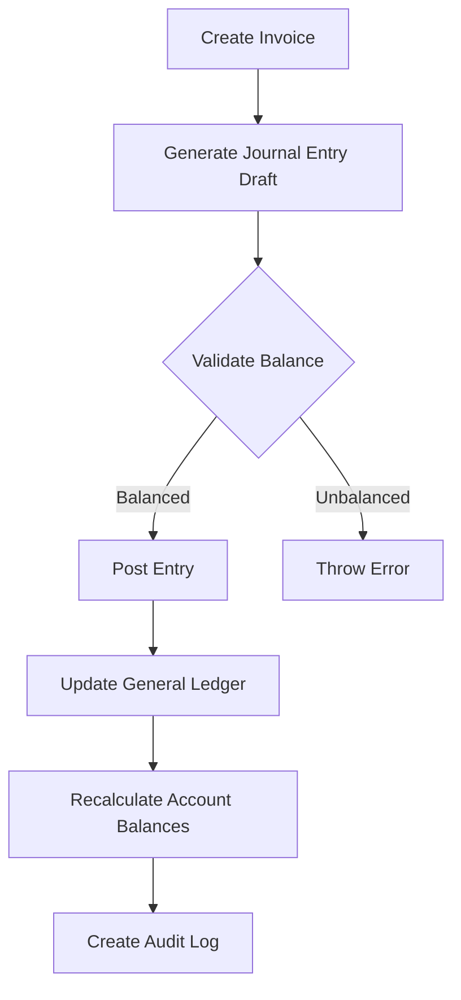

# ThirdBooks Architecture Documentation

## System Overview

ThirdBooks is a modern, multi-tenant accounting management system built with Laravel 11, Vue 3, and Flutter. It follows a microservices-inspired architecture with a centralized API backend, responsive web frontend, and native mobile admin apps.

## Architecture Diagram

```
┌─────────────────────────────────────────────────────────────┐
│                    CLIENT APPLICATIONS                       │
├─────────────────────────────────────────────────────────────┤
│                                                               │
│  ┌──────────────────┐  ┌──────────────────┐  ┌───────────┐ │
│  │   Web App        │  │  iOS Admin App   │  │  Android  │ │
│  │  (Vue 3 PWA)     │  │   (Flutter)      │  │   Admin   │ │
│  │  - Inertia.js    │  │  - Riverpod      │  │  (Flutter)│ │
│  │  - Offline-first │  │  - Read-only     │  │  - Drift  │ │
│  └──────────────────┘  └──────────────────┘  └───────────┘ │
│           │                      │                   │        │
└───────────┼──────────────────────┼───────────────────┼───────┘
            │                      │                   │
            └──────────────────────┴───────────────────┘
                                   │
                                   ↓ HTTPS / REST API
┌─────────────────────────────────────────────────────────────┐
│                    BACKEND API SERVER                        │
├─────────────────────────────────────────────────────────────┤
│                                                               │
│  ┌────────────────────────────────────────────────────────┐ │
│  │              Laravel 11 API (PHP 8.3)                  │ │
│  ├────────────────────────────────────────────────────────┤ │
│  │                                                         │ │
│  │  ├─ Authentication (Laravel Sanctum)                   │ │
│  │  ├─ Multi-Tenancy (Stancl/Tenancy)                     │ │
│  │  ├─ Double-Entry Bookkeeping Engine                    │ │
│  │  ├─ Report Generation Service                          │ │
│  │  ├─ Sync Manager (Offline support)                     │ │
│  │  └─ Background Jobs (Redis Queue)                      │ │
│  │                                                         │ │
│  └────────────────────────────────────────────────────────┘ │
│                                                               │
└───────────────────────────────┬───────────────────────────────┘
                                │
                ┌───────────────┴───────────────┐
                │                               │
                ↓                               ↓
    ┌───────────────────┐         ┌───────────────────┐
    │   PostgreSQL 15+  │         │    Redis Cache    │
    │   (Primary DB)    │         │   & Job Queue     │
    │                   │         │                   │
    │  - Central DB     │         │  - Session cache  │
    │  - Tenant DBs     │         │  - Queue jobs     │
    │  - Row-level      │         │  - Rate limiting  │
    │    security       │         └───────────────────┘
    └───────────────────┘
```

## Key Components

### 1. Multi-Tenancy Architecture

ThirdBooks supports two multi-tenancy strategies:

#### Strategy A: Single Database, Shared Schema (Default)
- All tenants share the same database
- Every table has a `company_id` column
- Laravel automatically scopes all queries
- Cost-effective for SaaS
- Recommended for most use cases

```sql
-- Example: All tables have tenant_id
SELECT * FROM invoices WHERE company_id = ?
```

#### Strategy B: Multi-Database
- Each tenant has a separate database
- Complete data isolation
- Better for enterprise clients
- Higher operational complexity

### 2. Double-Entry Bookkeeping Engine

The core of ThirdBooks is the double-entry accounting engine:

```
Transaction Flow:
1. User creates invoice/bill/payment
2. System generates Journal Entry (draft)
3. Journal Entry validated (debits = credits)
4. Journal Entry posted
5. General Ledger updated
6. Account balances recalculated
```

**Critical Rules Enforced:**
- Debits MUST equal Credits (database trigger)
- Accounts cannot be negative (unless explicitly allowed)
- Posted entries cannot be modified
- Period locking prevents backdating
- Full audit trail maintained

### 3. Database Schema

```
Central Database (Tenant Management):
├── tenants
├── domains
├── users
└── sessions

Tenant Database (Accounting Data):
├── companies
├── currencies
├── exchange_rates
├── accounts (Chart of Accounts)
├── journal_entries
├── journal_lines
├── general_ledger
├── customers
├── invoices
├── invoice_lines
├── payments
├── vendors
├── bills
├── bill_lines
├── bill_payments
├── audit_logs
└── sync_logs
```

### 4. Account Structure

ThirdBooks uses a hierarchical Chart of Accounts:

```
1000-1999: Assets
  1000-1499: Current Assets
  1500-1899: Fixed Assets

2000-2999: Liabilities
  2000-2499: Current Liabilities
  2500-2899: Long-term Liabilities

3000-3999: Equity

4000-4999: Income/Revenue

5000-9999: Expenses
  5000-5999: Cost of Goods Sold
  6000-8999: Operating Expenses
  9000-9999: Other Expenses
```

### 5. Transaction Posting Flow



### 6. Offline Sync Strategy

The web PWA and mobile apps support offline operation:

1. **Offline Mode:**
   - Data stored in IndexedDB (web) or Drift (mobile)
   - User can create/edit transactions
   - Changes queued for sync

2. **Sync Process:**
   - Background sync when online
   - Conflict detection (timestamp-based)
   - User-prompted resolution for financial data
   - Retry queue for failed syncs

3. **Conflict Resolution:**
   - Last-Write-Wins for non-financial data
   - User confirmation required for financial changes
   - Version vectors track changes

### 7. Security Layers

```
┌─────────────────────────────────────┐
│ 1. HTTPS/TLS Encryption             │
├─────────────────────────────────────┤
│ 2. JWT Authentication (Sanctum)     │
├─────────────────────────────────────┤
│ 3. Tenant Isolation Middleware      │
├─────────────────────────────────────┤
│ 4. Role-Based Access Control (RBAC) │
├─────────────────────────────────────┤
│ 5. Row-Level Security (PostgreSQL)  │
├─────────────────────────────────────┤
│ 6. Audit Trail (All Actions Logged) │
├─────────────────────────────────────┤
│ 7. Rate Limiting (Redis)            │
└─────────────────────────────────────┘
```

### 8. Performance Optimizations

1. **Database:**
   - Strategic indexes on foreign keys and date columns
   - Denormalized General Ledger for fast queries
   - Materialized views for common reports
   - Connection pooling

2. **Caching:**
   - Redis cache for:
     - User sessions
     - Exchange rates
     - Account balances
     - Report results (15 min TTL)

3. **Background Jobs:**
   - Heavy reports generated in queue
   - Email sending via queue
   - Backup jobs scheduled
   - Exchange rate updates

4. **API:**
   - Pagination on all list endpoints
   - Eager loading to prevent N+1 queries
   - Response caching with ETags
   - GZIP compression

### 9. Backup Strategy

```
Daily Backups (2 AM EAT):
├── PostgreSQL Full Dump
├── Files (receipts, attachments)
└── Redis snapshot

Weekly Backups:
├── Full system backup
└── Off-site replication

Retention:
├── Daily: 7 days
├── Weekly: 4 weeks
└── Monthly: 12 months
```

### 10. Deployment Architecture

```
Production Environment:

┌─────────────────────────────────────┐
│     Load Balancer (Nginx)           │
└─────────────┬───────────────────────┘
              │
    ┌─────────┴─────────┐
    │                   │
    ↓                   ↓
┌─────────┐       ┌─────────┐
│ API #1  │       │ API #2  │
│ Laravel │       │ Laravel │
└─────────┘       └─────────┘
    │                   │
    └─────────┬─────────┘
              │
    ┌─────────┴─────────┐
    │                   │
    ↓                   ↓
┌──────────┐      ┌──────────┐
│PostgreSQL│      │  Redis   │
│ Primary  │      │  Cluster │
└─────┬────┘      └──────────┘
      │
      ↓
┌──────────┐
│PostgreSQL│
│ Replica  │
└──────────┘
```

## API Design Principles

1. **RESTful Endpoints:** Standard HTTP methods
2. **Versioning:** `/api/v1/...`
3. **Pagination:** Always paginate lists
4. **Filtering:** Query string parameters
5. **Sorting:** `?sort=date&order=desc`
6. **Includes:** `?include=lines,customer`
7. **Error Handling:** Consistent JSON error responses
8. **Rate Limiting:** 60 requests/minute per user

## Accounting Standards Compliance

ThirdBooks follows:
- **GAAP** (Generally Accepted Accounting Principles)
- **IFRS** (International Financial Reporting Standards)
- **Uganda Revenue Authority (URA)** regulations
- **Double-Entry Bookkeeping** principles

## Future Enhancements

1. **Phase 2:**
   - Advanced budgeting
   - Multi-company consolidation
   - Cash flow forecasting

2. **Phase 3:**
   - AI-powered expense categorization
   - Automated bank feeds
   - Smart invoice matching

3. **Phase 4:**
   - EFRIS integration (URA Uganda)
   - Real-time tax calculation
   - E-invoicing compliance

---

**Last Updated:** January 2026
**Version:** 1.0.0
